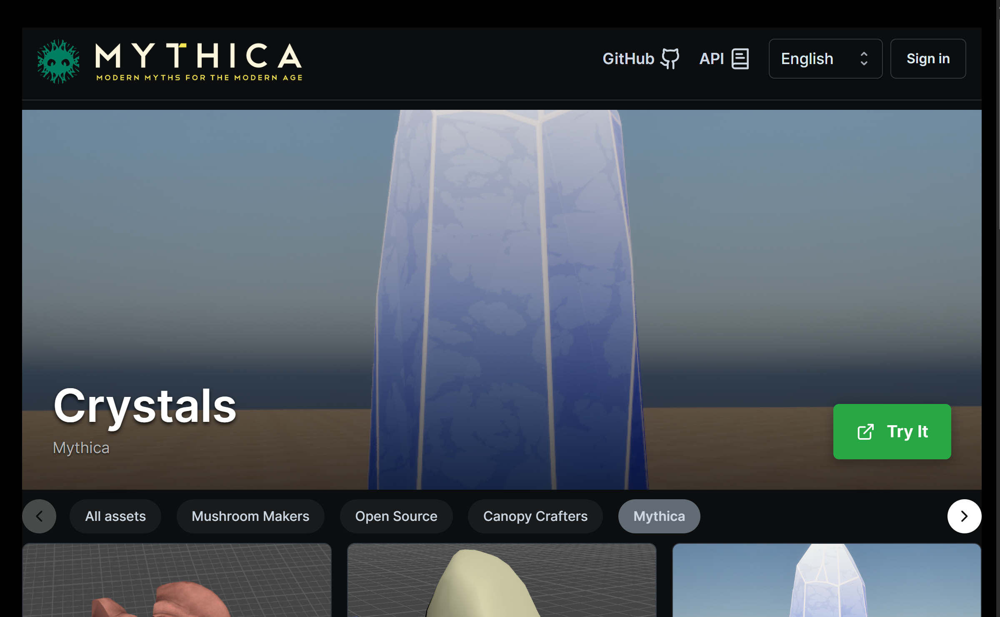

# Jungle - Asset Management System



An asset management and automation framework system including API, front-end components and backend automations.

Primary uses cases are:

* Game asset management tracking
* Automating procedural tasks with Houdini against game assets
* Automating procedural tasks with Blender against game assets

The asset management system is a headless CMS system with a job execution API capable of modeling 
multi-file game asset data.

For real time interactive control see [SceneTalk](https://github.com/MythicaAI/scenetalk)

Basic front ends for graph editing and user asset management are included.

* **ams/**             
  * Asset management system backend API
* **canary/**             
  * Asset management system backend API
* **bulk-import/**             
  * Bulk importer to bring assets into the API
* **test-worker/**             
  * A simple template for worker automations
* **automations/**
  * Backend automations for automating Houdini, Blender and AI workloads behind the AMS APIs
* **apps/**
  * Front end applications built on the API

## Running Locally

Backend components are based on Python and front end components are based on React+Vite.

Developer actions are implemented with `invoke` in tasks.py

### Python setup
1. Ensure you have [Python3](https://python.org) and Node installed.
1. Local build dependencies are in `local_requirements.tat`
1. Run `pip install -r local_requirements.txt`


### Environment Variables
NB: `/.env.local` supports setting required `env` vars for the infrastructure that are loaded by the next step. 
The required vars are defined in `/.env`

### Create the base virtual environment

```bash
. ./env.sh
```

```cmd
env.bat
```

### Service tiers

Services are segmented into tiers to make local development easier.

* `storage` (Database, cache and files)
* `web` web and API serving
* `auto`mation (Packaging, Houdini automation)

For local testing, each tier is implemented in a separate `docker-compose.yaml`.

For example, see `testing/storage`

Each tier has commands defined in the root `tasks.py` file.

For example, to start the storage tier locally:

```bash
invoke storage-start
```

This start task will automatically stop the docker compose instance.

You can see what services are running

```bash
# check running services
docker ps

# see all services that have run
docker ps -a

# see the logs for a terminated container:
docker logs <container-id>
```

## Setup - Linux and Mac

We currently recommend using `asdf` or `brew` to manage local tool versions. 

For ASDF see `.tool-versions`.

To install all tools:

- [Install `asdf`](https://asdf-vm.com/guinpde/getting-started.html)

- Install plugins:

  ``` shell
  asdf plugin-add terraform https://github.com/asdf-community/asdf-hashicorp.git
  asdf plugin add gcloud https://github.com/jthegedus/asdf-gcloud
  asdf plugin-add kubectl https://github.com/asdf-community/asdf-kubectl.git
  asdf plugin add nodejs https://github.com/asdf-vm/asdf-nodejs.git
  ```

- Install tools:

  ``` shell
  asdf install
  ```

For further setup information for Terraform or k8s check the README
files in those subfolders.

## Setup - Windows

node.js must be installed manually from https://nodejs.org/en/download

On windows `chocolatey` is recommended for tool support.

### Install with poetry

`poetry` installs package requirements from an automatically locked
and hashed set of dependencies. It is a combination of pip and venv so it can
simplify working with these technologies while ensuring deterministic builds.

From Linux, macOS or Windows:

```bash
ams/> poetry install
```

You can run a command using the poetry virtual environment

```bash
ams/> poetry run pytest .
```

## Working on Sites

Sites are combinations of static content that can be served directly from a web server such
as NGINX.

* Edit site data in sites/<sitename>
* Publish changes with sites/publish.sh <sitename>
* Build vite-based sites with sites/build.sh <sitename>


### React / Node Sites

Installing node dependencies in a sites/ project

```bash
asdf shell nodejs 22.2.0
cd ../sites/jungle2
corepack enable pnpm
asdf reshim nodejs
pnpm install
```

Builds can be automated through a container. See sites/jungle3/Dockerfile for an example.

The build script uses standard docker commands to build the content and copy it into the local
filesystem.

## Code Generation

The API and Sites use some code-generated types. These types are committed and only need to be generated
if changes are made to definitions in the codegen/ project.

Schema types can be generated with the `codegen` project

```bash
python -m codegen.codegen
```


## CI Tests

The Git workflow file `.github/workflows/ci-ams-app.yaml` is set up to run tests on every push event within a PR.

Once changes are pushed, the job will execute pytest tests, and the coverage results will be published as a comment in the PR. This comment will include a table for every `.py` file located in the `ams/` directory.

The table is generated from the pytest step in subsequent steps using a shell script that formats the results for display in the PR. Based on the environment variable defined in the workflow file (`jobs: > ci-ams-app: > env: > TEST_FAIL_RATE: `), the workflow will determine if the test results have decreased beyond the specified rate. If the threshold is exceeded, the subsequent step, `Coverage total fail - exit`, will cause the tests to fail.

Additionally, there is an option to see the code coverage for each file individually.

To create a `.coverage` file and generate an HTML report for viewing in a browser, run the following commands inside the `ams/` folder:

```bash
pytest --cov --cov-report=html:coverage
coverage html
```


